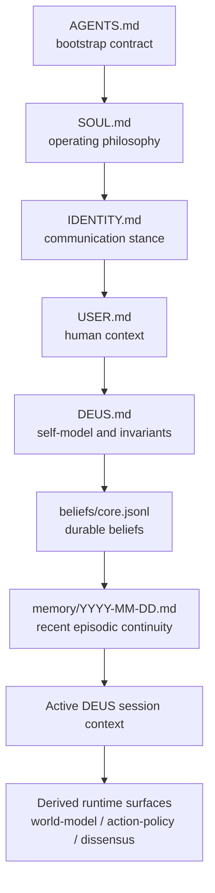
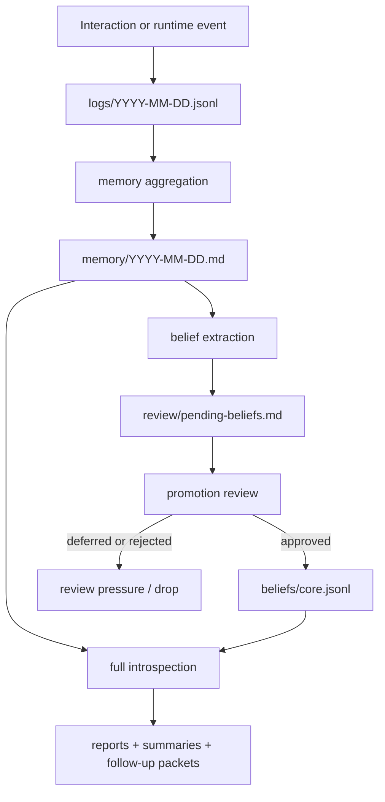
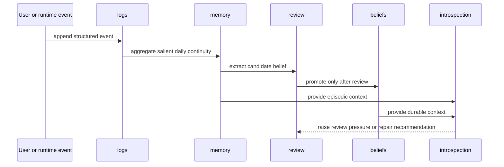
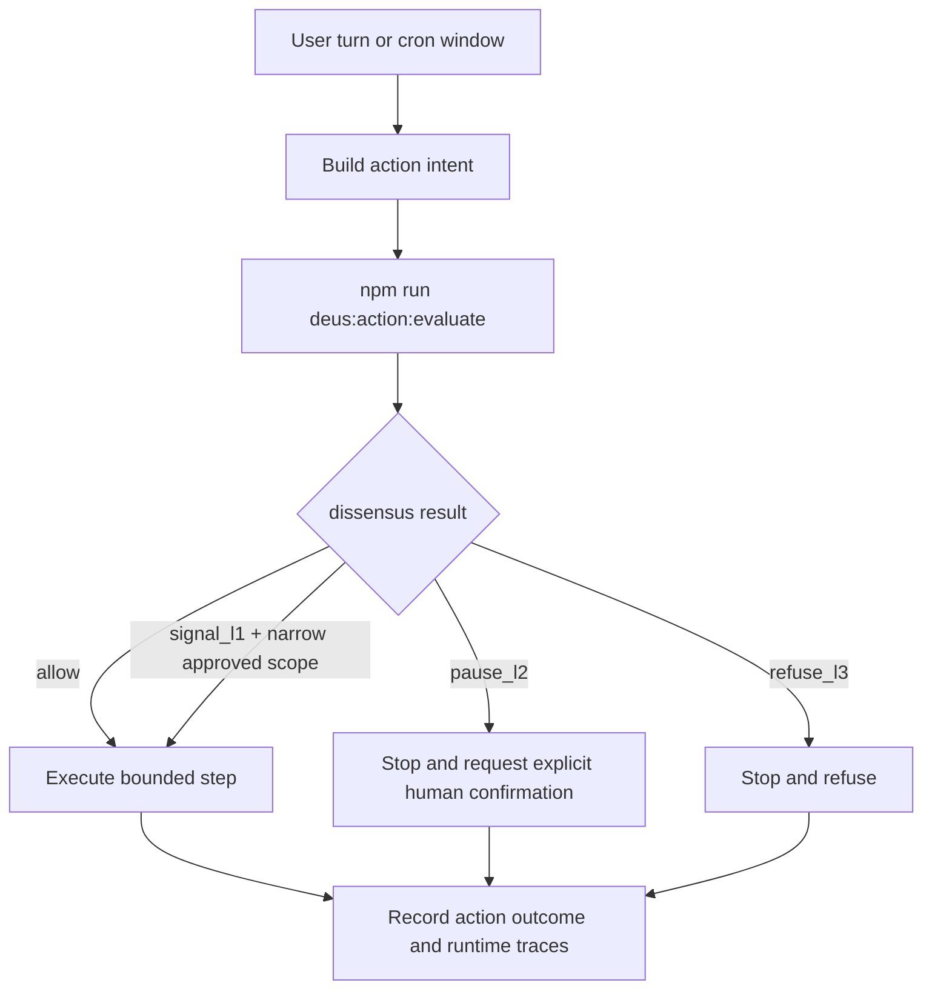

# DEUS on OpenClaw

> A self-contained cognitive runtime layer for OpenClaw with explicit memory, beliefs, introspection, and action gating.

## What This Repository Is

This repository contains a working implementation of **DEUS** as an operational layer on top of **OpenClaw**.

DEUS is not a standalone model and not a generic prompt pack.
It is a structured runtime architecture that gives an OpenClaw-based agent explicit continuity and inspectable internal surfaces.

In this repository, DEUS is implemented through:

- a bootstrap stack instead of one hidden system prompt;
- durable beliefs instead of only transient context;
- episodic memory instead of a stateless chat history;
- reflective routines for introspection and review;
- action evaluation and dissensus for higher-impact operations.

This repository is currently the primary public reference implementation of DEUS.
No prior external DEUS specification is assumed.
This README is therefore self-contained and should be treated as the first entrypoint into the concept as implemented here.

For installation, start with `INSTALL.md`.
Repository mutation rules are generated locally during AgentPlane initialization; the public branch does not ship `AGENTPLANE.md`.

## Quick Install

Use this when you want a working local DEUS workspace on top of a clean OpenClaw base.

```bash
# run from the target workspace root
git clone https://github.com/basilisk-labs/openclaw-deus.git .
npm install

if ! command -v agentplane >/dev/null 2>&1; then
  npm install -g agentplane@latest
fi

if [ ! -d .agentplane ]; then
  mkdir -p .tmp/install
  cp AGENTS.md .tmp/install/AGENTS.md.original
  cp .gitignore .tmp/install/.gitignore.original
  agentplane init \
    --setup-profile light \
    --policy-gateway codex \
    --workflow direct \
    --backend local \
    --hooks false \
    --gitignore-agents \
    --yes
  mv AGENTS.md AGENTPLANE.md
  cp .tmp/install/AGENTS.md.original AGENTS.md
  cp .tmp/install/.gitignore.original .gitignore
  git reset -q HEAD -- .gitignore >/dev/null 2>&1 || true
  git checkout -- .gitignore >/dev/null 2>&1 || true
  rm -f CLAUDE.md
fi

agentplane doctor
npm run deus:bootstrap
npm run deus:health
```

Expected result:
- repository files are materialized directly in the workspace root
- `AGENTS.md` remains the repository-owned DEUS bootstrap entrypoint
- local `.agentplane/` and local `AGENTPLANE.md` exist as post-install workflow overlay
- tracked repository files stay clean after installation

## Conceptual Model

DEUS is implemented here as a **cognitive runtime layer** for OpenClaw.

- **OpenClaw** provides runtime execution, integrations, session plumbing, and orchestration.
- **DEUS** provides identity assembly, memory continuity, belief persistence, reflective routines, and guarded action evaluation.

This distinction matters.
DEUS is not the shell, browser, scheduler, or tool gateway.
It is the structured layer that makes the agent stateful, inspectable, and more coherent across time.

## What Problems This Repository Solves

A default agent session typically has several weaknesses:

- important context remains trapped in transient conversation state;
- long-term beliefs stay implicit and hard to inspect;
- memory promotion is ad hoc;
- reflective behavior is mixed into prompts and becomes hard to reason about;
- higher-impact actions are not always evaluated through an explicit gate.

This repository addresses those weaknesses by making the internal cognitive surfaces explicit and observable.

## Repository Authority Model

The system distinguishes between:

1. **canonical project material** — code, docs, bootstrap files, policies;
2. **live mutable runtime state** — memory, beliefs, logs, introspection outputs, review artifacts;
3. **ephemeral local residue** — caches, temporary files, and local overlays.

Current rule:

- the repository root is the default canonical root;
- live runtime surfaces are part of the same workspace by default;
- any external runtime-root split is a local deployment overlay, not a repository requirement.

## Authority Layers

| Layer | Authority | Typical contents | Sync rule |
| --- | --- | --- | --- |
| Canonical trunk | GitHub branch | `src/`, `scripts/`, `tests/`, `AGENTS.md`, `DEUS.md`, `USER.md`, `docs/` | edit locally, verify, then push intentionally |
| Live runtime | active workspace | `STATUS.md`, `beliefs/`, `memory/`, `logs/`, `review/`, `dissensus/`, `docs/introspection/`, `reports/`, runtime artifacts | preserve live state, then promote intentionally |
| Ephemeral local/runtime residue | local machine or service-local cache | `.tmp/`, `.openclaw/`, `.openclaw-flush`, local `.agentplane/`, local `AGENTPLANE.md`, transient diagnostics | never treat as canonical by default |

## Why The Authority Split Exists

Canonical code and live cognitive state have different constraints.

- canonical material must stay reviewable, reproducible, and safe to publish;
- runtime state must stay mutable, continuous, and operational;
- mixing both in one working tree corrupts both responsibilities.

The authority split exists to preserve that separation without forcing any particular deployment topology into the public branch.

## Bootstrap And Identity Assembly

DEUS is not driven by one hardcoded system prompt.
Its active operating context is assembled from a bootstrap stack.

Bootstrap order:

1. `AGENTS.md`
2. `SOUL.md`
3. `IDENTITY.md`
4. `USER.md`
5. `DEUS.md`
6. `beliefs/core.jsonl`
7. recent `memory/YYYY-MM-DD.md`



Interpretation:

- bootstrap files define identity, constraints, and operating stance;
- beliefs and recent memory provide continuity;
- runtime layers such as world-model, action-policy, and dissensus are derived operational surfaces, not replacements for the bootstrap stack.

## Memory And Belief Pipeline

Memory promotion is review-first.

Not every interaction becomes memory.
Not every memory item becomes a durable belief.





Important runtime rule:

- `npm run deus:sleep` is bounded reflection and does **not** run full belief extraction, contradiction scanning, or decay;
- `npm run deus:introspect` runs the heavy reflective pass and may produce review or bounded repair recommendations;
- `npm run deus:nightly` is the full orchestrator: memory aggregation, bounded sleep, full introspection, bounded decay tuning, and reviewed belief promotion.

## Action Gating And Dissensus

DEUS includes a dissensus layer for higher-impact actions.

This is not a full autonomous constitutional system.
It is a bounded evaluation and gating layer used to determine whether a proposed action should proceed.

Current decision space:

- `allow`
- `signal_l1`
- `pause_l2`
- `refuse_l3`

Current runtime rule:

- high-impact cron/runtime paths must run `npm run deus:action:evaluate -- '<intent-json>'` before mutating repository state, beliefs, runtime state, or external surfaces;
- `pause_l2` and `refuse_l3` stop the action;
- `signal_l1` only allows continuation inside an already approved narrow scope.



Live runtime dissensus artifacts:

- `dissensus/events/YYYY-MM-DD.jsonl`
- `dissensus/open-cases.json`
- `dissensus/overrides.jsonl`

## Key Surfaces

### Core documents

- `INSTALL.md` — installation and bootstrap instructions
- `AGENTS.md` — DEUS bootstrap entrypoint
- local `AGENTPLANE.md` — generated mutation workflow gateway after AgentPlane initialization
- `DEUS.md` — self-model and invariants
- `USER.md` — human/operator context
- `docs/DEUS_IMPLEMENTATION.md` — runtime modules and surfaces
- `docs/REFLEXIVE_RUNTIME.md` — sleep, introspection, nightly loops
- `docs/ARCHITECTURAL_BOUNDARY.md` — DEUS vs OpenClaw boundary
- `docs/workspace/CANONICAL_STATE.md` — authority model
- `docs/workspace/WORKSPACE_MAP.md` — workspace layer map

### Operational entrypoints

- `npm run deus:bootstrap`
- `npm run deus:health`
- `npm run deus:introspect:dry`
- `npm run deus:action:evaluate -- '<intent-json>'`
- `npm run doctor:workspace`

## Quick Start

1. Follow `INSTALL.md`.
2. Run `npm install` if dependencies are not yet present.
3. Run `npm run deus:bootstrap`.
4. Run `npm run deus:health`.
5. Read `AGENTS.md`, `DEUS.md`, and `docs/ARCHITECTURAL_BOUNDARY.md` before making structural changes.

## Current Working Model

What is already true:

- GitHub is the canonical source of truth for code and documentation.
- The active workspace is the live source of truth for mutable DEUS state until promotion.
- OpenClaw consumes the DEUS bootstrap from `AGENTS.md` and the current filesystem runtime surfaces.
- Memory, beliefs, introspection, and dissensus are explicit runtime surfaces, not hidden prompt magic.

What is intentionally bounded:

- dissensus is a narrow enforcement layer, not a full autonomous negotiation subsystem;
- bounded sleep is lighter than full introspection;
- external deployment overlays are not part of the clean-install contract.

## What DEUS Is Not

To avoid category confusion:

- DEUS is **not** a standalone foundation model;
- DEUS is **not** just a persona prompt;
- DEUS is **not** a replacement for OpenClaw;
- DEUS is **not** a claim of full autonomous subjectivity in this implementation.

This repository is a practical runtime implementation of a structured cognitive layer over OpenClaw.

## Where To Start

If you are new to this repository, read in this order:

1. `README.md`
2. `INSTALL.md`
3. `AGENTS.md`
4. `DEUS.md`
5. `docs/ARCHITECTURAL_BOUNDARY.md`
6. `docs/DEUS_IMPLEMENTATION.md`

If you are operating an existing deployment, also read:

7. `docs/REFLEXIVE_RUNTIME.md`
8. `docs/workspace/CANONICAL_STATE.md`
9. `docs/workspace/WORKSPACE_MAP.md`
